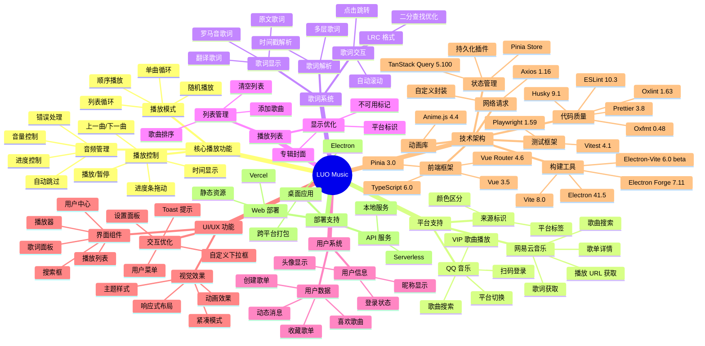

# luo_music

基于 Vue 3 + Pinia + Electron + TypeScript + TanStack Query 的跨平台音乐播放器

[](https://github.com/sansenjian/luo_music/actions/workflows/test.yml)
[](https://codecov.io/gh/sansenjian/luo_music)

> ⚠️ **已知问题**：使用「沉浸式翻译」浏览器插件可能导致歌词不显示。如果遇到歌词不显示的问题，请尝试禁用该插件或将其加入白名单。

## 🎉 最新动态

### v2.3 - VSCode 开发环境优化 (2026-03-15)

- ✅ **调试配置** - 添加 launch.json，支持主进程/渲染进程联合调试
- ✅ **扩展推荐** - 推荐 8 个必备 VSCode 扩展
- ✅ **任务配置** - 8 个常用任务一键执行
- ✅ **Git 钩子** - Husky + Vite+ staged 预提交检查
- ✅ **提交规范** - 约定式提交模板
- ✅ **GitHub 模板** - PR/Issue 模板规范化
- ✅ **依赖清理** - 移除未使用的 Babel 依赖
- ✅ **文档完善** - 新增 VSCode 配置文档和快速参考

### v2.2 - Electron-Vite 构建升级 (2026-03-10)

- ✅ **electron-vite 迁移** - 从 electron-builder + tsup 迁移到 electron-vite 方案
- ✅ **TypeScript 测试迁移** - 所有测试文件从 JavaScript 迁移到 TypeScript
- ✅ **构建输出收敛** - Web 输出到 `dist/`，Electron bundle 与本地服务输出到 `build/`
- ✅ **开发体验优化** - 主进程和渲染进程都支持 HMR 热更新
- ✅ **文档完善** - 新增构建文档和迁移指南（见 [`docs/`](./docs/) 目录）

### v2.1 - 架构升级与优化 (2026-03-04)

- ✅ **TypeScript 迁移** - 音乐平台适配器层全面 TypeScript 化
- ✅ **TanStack Query 引入** - 引入 Vue Query 进行状态管理和数据缓存
- ✅ **测试覆盖提升** - 新增组件和 Store 的单元测试
- ✅ **性能优化** - 用户数据响应式更新，减少不必要的请求

### v2.0 - 双平台支持 (2026-03-01)

- ✅ **QQ 音乐平台支持** - 搜索、播放、歌词一站式体验
- ✅ **平台切换功能** - 搜索框旁可切换网易云/QQ 音乐
- ✅ **扫码登录 QQ 音乐** - 获取 VIP 歌曲播放权限
- ✅ **来源标识** - 歌曲名旁显示平台标签（红色=网易，绿色=QQ）
- ✅ **专辑封面显示** - 播放列表和播放器显示封面
- ✅ **优化 UI 设计** - 自定义下拉框、用户菜单美化

## 🚀 开发计划

- [x] 进度条拖动时实时追踪歌词
- [x] 升级 Vite 到 v8 版本
- [x] 升级 Vue 到 v3.5 版本
- [x] 升级 Node.js 到 v24 版本
- [x] 升级 Electron 到 v40 版本
- [x] 双平台搜索支持（网易云 + QQ 音乐）
- [x] QQ 音乐扫码登录功能
- [x] 播放列表专辑封面显示
- [x] 自定义平台选择下拉框
- [x] 用户头像下拉菜单优化
- [x] 添加功能思维导图
- [x] 引入 TypeScript 支持
- [x] 引入 TanStack Query (Vue Query)
- [x] VSCode 调试配置完善
- [x] Git 提交规范化
- [x] 预提交代码检查
- [ ] 消除翻译歌词不显示问题（QQ 音乐数据源问题）
- [ ] 进行录屏或者截图会出现白屏问题
- [x] 重构 playerStore 消除上帝类问题
- [x] 优化歌词滚动性能

## 功能思维导图



## 功能特性

### P0 核心功能

- ✅ 音乐播放控制（播放/暂停/上一曲/下一曲）
- ✅ 播放进度控制（进度条拖动/时间显示）
- ✅ 歌词实时同步显示（LRC 格式解析）
- ✅ 歌曲搜索（支持网易云音乐 + QQ 音乐）
- ✅ 播放列表管理
- ✅ 平台切换（网易云/QQ 音乐一键切换）

### P1 增强功能

- ✅ 音量控制（持久化、支持拖动）
- ✅ 播放模式切换（顺序/循环/单曲/随机）
- ✅ 多层歌词支持（原文/翻译/罗马音）
- ✅ 歌词点击跳转
- ✅ 歌词自动滚动（二分查找优化）
- ✅ 响应式布局（桌面端/移动端适配）
- ✅ 桌面应用支持（Electron）
- ✅ 按钮动画效果（Anime.js）
- ✅ 进度条拖动定位
- ✅ Web 浏览器支持（Chrome/Edge/Firefox）
- ✅ QQ 音乐扫码登录
- ✅ 专辑封面显示
- ✅ 来源标识（平台标签）
- ✅ 登录状态检测

## 技术栈

| 技术                          | 版本           | 用途              |
| ----------------------------- | -------------- | ----------------- |
| Vue                           | 3.5.34         | 前端框架          |
| TypeScript                    | 6.0.3          | 静态类型检查      |
| Electron                      | 41.5.1         | 桌面应用框架      |
| Pinia                         | 3.0.4          | 状态管理          |
| TanStack Query                | 5.100.10       | 服务端状态管理    |
| Pinia Plugin Persistedstate   | 4.7.1          | 状态持久化        |
| Axios                         | 1.16.0         | HTTP 客户端       |
| Vite                          | 8.0.12         | 构建工具          |
| Vite+                         | 0.1.20         | 统一工具链入口    |
| Anime.js                      | 4.4.1          | 动画效果          |
| NeteaseCloudMusicApi Enhanced | 4.32.0         | 网易云音乐 API    |
| QQ Music API                  | 2.2.10         | QQ 音乐 API 服务  |
| Electron-Vite                 | 6.0.0-beta.1   | Electron 构建工具 |
| Electron Forge                | 7.11.1         | Electron 打包工具 |
| Oxlint                        | 1.63.0         | 主线代码检查      |
| ESLint                        | 10.3.0         | 兼容性备用检查    |
| Prettier                      | 3.8.3          | 默认代码格式化    |
| Oxfmt                         | 0.48.0         | 可选快速格式化    |
| Vitest                        | 4.1.6          | 单元测试框架      |
| Playwright                    | 1.59.1         | E2E 测试框架      |
| VitePress                     | 2.0.0-alpha.17 | 文档生成工具      |
| Husky                         | 9.1.7          | Git 钩子          |
| Vite+ staged                  | 0.1.20         | 预提交检查        |

> 版本信息以 `package.json` 为准；上表只记录当前主线依赖快照。

## 依赖结构说明

项目采用**依赖分离**策略，优化 Web 部署体积：

```json
{
  "dependencies": {
    // 运行时依赖
    "vue": "^3.5.34",
    "pinia": "^3.0.4",
    "animejs": "^4.4.1",
    "@tanstack/vue-query": "^5.100.10",
    "axios": "^1.16.0",
    "@vueuse/core": "^14.3.0",
    "zod": "^4.4.3"
    // ...
  },
  "devDependencies": {
    // 构建与桌面端工具链
    "electron": "41.5.1",
    "electron-vite": "^6.0.0-beta.1",
    "@electron-forge/cli": "^7.11.1",
    "typescript": "^6.0.3",
    "vue-tsc": "^3.2.8"
    // ...
  }
}
```

### 依赖清理

项目已清理以下未使用的依赖：

- ❌ `@babel/plugin-transform-async-to-generator` - 未使用
- ❌ `@babel/register` - 未使用
- ❌ `combined-stream` - 传递依赖
- ❌ `delayed-stream` - 传递依赖
- ❌ `mime-db` - 传递依赖
- ❌ `mime-types` - 传递依赖

### 为什么这样设计？

| 场景                | 安装命令                      | 安装的依赖                        |
| ------------------- | ----------------------------- | --------------------------------- |
| **本地开发**        | `npm install --prefer-online` | 全部依赖                          |
| **Electron 打包**   | `npm install --prefer-online` | 全部依赖                          |
| **Vercel Web 部署** | `npm install --prefer-online` | 全部依赖，Web 构建需要 dev 工具链 |

项目 `.npmrc` 默认使用官方 npm registry，并启用 `prefer-online` 避免旧缓存或镜像元数据导致版本解析落后。CI 环境优先使用 `npm ci --prefer-online`。

### 安装 Electron 相关依赖

```bash
# 安装 Electron（开发依赖）
npm install -D electron --prefer-online

# 安装 Electron 打包工具
npm install -D @electron-forge/cli --prefer-online

# 安装 Electron-Vite
npm install -D electron-vite --prefer-online
```

> **注意**：Electron 相关包必须放在 `devDependencies` 中，作为桌面端构建工具链维护；Web 构建会安装完整依赖，但不会把这些工具包打进最终浏览器运行产物。

## 项目结构

```
luo_music/
├── api/              # Vercel Serverless Function 入口（部署路由，不是渲染层 API）
│   ├── [...netease].ts
│   └── qq/
│       └── [...qq].ts
├── docs/             # 项目文档 (VitePress)
│   ├── .vitepress/   # 站点配置
│   ├── guide/        # 开发指南
│   ├── architecture/ # 架构设计
│   ├── reference/    # 参考资料与示例
│   ├── plans/        # 方案与计划
│   ├── reports/      # 审查与归档报告
│   └── index.md      # 文档首页
├── electron/         # Electron 主进程代码与 Electron 专属配置
│   ├── main/         # 主进程模块
│   │   ├── index.ts  # 主进程入口
│   │   ├── app.ts    # 应用生命周期
│   │   ├── tray.ts   # 系统托盘
│   │   └── shortcuts.ts # 快捷键
│   ├── sandbox/      # 预加载脚本
│   ├── ipc/          # IPC 通信
│   ├── local-library/# 本地音乐库扫描与索引
│   ├── plugins/      # 插件宿主能力
│   ├── service/      # 本地服务管理
│   ├── utils/        # 工具函数
│   ├── WindowManager.ts
│   ├── ServiceManager.ts  # 服务管理 (子进程)
│   ├── utils/paths.ts
│   ├── vite.config.ts
│   ├── forge.config.ts
│   └── builder.portable.cjs
├── scripts/          # 构建脚本
│   ├── dev/          # 开发脚本
│   └── utils/        # 工具脚本
├── server/           # API 服务端
│   └── index.ts
├── packages/
│   ├── plugin-sdk/   # 插件开发 SDK
│   └── shared/       # renderer / preload / main 共享协议和纯合同
│       ├── contracts/# audio/config/log/netease/ipc/sandbox 等纯共享合同
│       ├── player/   # 播放模式、歌词等跨端播放器纯类型 / 纯工具
│       ├── protocol/ # IPC channel/cache 等协议常量
│       └── types/    # schema/localLibrary/player/platform 等跨端纯类型
├── plugins/
│   ├── examples/     # 插件示例
│   └── third-party/  # 第三方插件
├── src/
│   ├── api/          # 渲染侧 API 适配层（请求封装、参数与响应适配）
│   ├── assets/       # 静态资源（CSS/字体）
│   ├── base/         # 基础架构 (事件/生命周期)
│   ├── components/   # 跨功能复用 Vue 组件
│   │   ├── home/     # HomeEmptyState 等跨页面复用的 Home 来源组件
│   │   ├── media/    # AlbumDetailPanel/FavoriteAlbumsView/SongDetailList 等媒体展示组件
│   │   ├── settings/
│   │   └── window/
│   ├── composables/  # 跨功能复用组合式函数
│   ├── features/     # 成规模业务域
│   │   ├── home/     # 首页 feature，包含专属 components/composables 和 public API
│   │       ├── components/
│   │       ├── composables/
│   │       └── index.ts
│   │   └── user-center/ # 用户中心页面专属组件/composables 和 public API
│   │       ├── components/
│   │       ├── composables/
│   │       └── index.ts
│   ├── platform/     # 平台适配层 (TypeScript)
│   │   ├── music/    # 音乐平台适配器
│   │   ├── electron/ # Electron 平台服务
│   │   └── web/      # Web 平台服务
│   ├── router/       # 路由配置
│   ├── services/     # 服务注册表
│   ├── store/        # Pinia 状态管理
│   ├── types/        # TypeScript 类型定义
│   ├── utils/        # 工具函数
│   │   ├── http/     # HTTP 请求封装
│   │   ├── error/    # 错误处理
│   │   ├── cache/    # 缓存管理
│   │   └── player/   # 播放器模块
│   ├── views/        # 页面视图
│   ├── App.vue       # 根组件
│   └── main.ts       # 入口文件
├── tests/            # 测试目录
│   ├── base/         # 基础架构测试
│   ├── components/   # 组件测试
│   ├── electron/     # Electron 测试
│   ├── platform/     # 平台适配器测试
│   ├── store/        # Store 测试
│   └── utils/        # 工具函数测试
├── build/            # Electron bundle 与本地服务构建输出
├── dist/             # Web 构建输出
├── .vscode/          # VSCode 配置
│   ├── launch.json   # 调试配置
│   ├── tasks.json    # 任务配置
│   ├── settings.json # 编辑器设置
│   └── extensions.json # 扩展推荐
├── .config/          # 开发工具配置
│   ├── vite.config.ts
│   ├── playwright.config.ts
│   ├── qodana.yaml
│   └── .env
├── config/           # 构建共享逻辑
│   ├── vite.shared.ts
│   ├── packaging.shared.cjs
│   └── .env.sentry
├── .husky/           # Git 钩子
├── .github/          # GitHub 配置
│   ├── ISSUE_TEMPLATE/
│   └── PULL_REQUEST_TEMPLATE.md
├── package.json
├── vite.config.ts
├── vercel.json
├── tsconfig.json
├── eslint.config.js
├── .npmrc
└── index.html
```

> 目录边界：根目录 `api/` 只服务 Vercel 部署的 Serverless Function 路由，例如 `/api/*` 与 `/qq-api` 重写；业务代码中的请求封装、响应适配和类型约束放在 `src/api/`。跨 Electron main / preload / renderer 的纯协议和纯合同优先放在 `packages/shared`，通过 `@shared/*` 导入。不要从渲染层、Electron 主进程或通用模块直接导入根 `api/` 下的部署 handler。

## 环境支持

本项目支持三种运行环境：

| 环境              | 适用场景                            | API 服务                   | 部署方式                                |
| ----------------- | ----------------------------------- | -------------------------- | --------------------------------------- |
| **Web 开发**      | 本地开发调试（Chrome/Edge/Firefox） | 本地 Node.js 服务          | `npm run dev`                           |
| **Electron 桌面** | Windows/Mac/Linux 桌面应用          | 内置/本地服务              | `npm run dev` 或 `npm run dev:electron` |
| **Vercel 线上**   | 线上 Web 访问                       | Vercel Serverless Function | 自动部署                                |

## 快速开始

### 环境要求

- Node.js 24+
- npm 10+

### 安装依赖

```bash
cd luo_music
npm install --prefer-online
```

项目 `.npmrc` 已固定使用官方 npm registry 并启用 `prefer-online`。如果本机全局 npm 配置里曾设置 `prefer-offline=true`，请先删除或覆盖它，避免继续读取旧元数据。

### Vite+ / VP CLI

项目使用本地 `vite-plus@0.1.20` 依赖提供 `vp` CLI。团队命令默认通过 npm scripts 调用项目内的 `./node_modules/vite-plus/bin/vp`，不要求全局安装。Windows / PowerShell 用户优先用下面的命令验证本地 CLI：

```bash
npm run vp:version
npm run vp:help
npm run vp:lint
npm run vp:fmt:check
npm run vp:check
npm run quality
```

当前迁移采用分阶段策略：Web 开发、Web 构建、Web 预览和 Electron renderer 开发服务器已经通过本地 VP CLI 调用 `.config/vite.config.ts`；测试、lint、format、check、staged 配置已经并入 Vite+ 配置链路，质量配置集中在根目录 `vite.config.ts`，应用和测试流程继续显式使用 `.config/vite.config.ts`。正式测试入口仍通过 `scripts/run-vitest-with-native-restore.cjs` 保护 `better-sqlite3` 的 Node / Electron ABI 切换，再调用本地 `vp test`；Electron main/preload bundle、Forge 打包和 portable 构建仍保留 Electron 专属脚本包装。

可选全局安装只用于提升手动执行 `vp migrate`、`vp help` 等命令的体验，项目运行仍以本地依赖和 npm scripts 为准。官方 Windows 安装命令如下：

```powershell
irm https://vite.plus/ps1 | iex
```

全局安装建议在原生 Windows Terminal / PowerShell 新窗口中执行；不要从 WSL bash 间接调用 PowerShell 安装脚本，否则可能遇到 Windows `cmd` / Node PATH 桥接问题。

如果在 WSL bash 中直接执行 `./node_modules/.bin/vp` 出现 `node: not found`，这是当前 shell 没有 Linux 侧 Node.js 或 PATH 未暴露导致的运行环境问题，不代表 Vite+ 安装失败。解决方式是改用 Windows PowerShell 中的 `npm run vp:version`，或在 WSL 内安装/暴露 Linux 侧 Node.js 后再运行本地 `vp`。

### NPM 脚本命令

```bash
# 开发模式
npm run dev              # 全部开发（API 服务器 + Vite）
npm run dev:web          # 仅 Web 开发（VP / Vite+）
npm run dev:electron     # Electron 开发（桌面应用）

# 生产构建
npm run build:web        # 输出 dist/ → Web 产物
npm run build:electron   # 输出 build/ + out/make/ → Electron 安装包
npm run build:electron:portable # 输出 out/portable/ → 单文件便携版

# 其他命令
npm run preview          # 预览构建结果
npm run test             # 运行测试
npm run vp:version       # 验证本地 VP / Vite+ CLI
npm run vp:help          # 查看 VP CLI 帮助
npm run vp:lint          # 通过 VP / Oxlint 检查代码
npm run vp:fmt:check     # 通过 VP / Oxfmt 检查格式
npm run vp:check         # 通过 VP 统一执行格式和 lint 检查
npm run quality          # 团队日常静态质量门禁
npm run clean            # 清理构建产物
```

---

## 🌐 Web 开发环境

### 启动开发服务器

**方式一：全部启动（推荐）**

```bash
npm run dev
```

同时启动：

- NeteaseCloudMusicApi 服务（端口 14532）
- Vite 开发服务器（端口 5173）

**方式二：仅启动前端**

```bash
npm run dev:web
```

仅启动 Vite 开发服务器，需要单独启动 API 服务或使用远程 API。

**方式三：分别启动（调试时使用）**

```bash
# 终端 1：启动 API 服务 (端口 14532)
npm run server

# 终端 2：启动前端开发服务器 (端口 5173)
npm run dev:web
```

### 构建 Web 版本

```bash
npm run build:web
```

构建输出目录：`dist/`

---

## 💻 Electron 桌面环境

### 开发模式

```bash
npm run dev:electron
```

启动内容：

- NeteaseCloudMusicApi 服务（端口 14532）
- Vite 开发服务器（端口 5173）
- Electron 桌面应用窗口

**特性**：

- ✅ **HMR 热更新** - 主进程和渲染进程都支持热更新
- ✅ **自动重启** - 主进程代码修改后自动重启
- ✅ **更好的 sourcemap** - 开发调试更方便

### 构建桌面应用

```bash
# 构建 Electron 应用（包含打包）
npm run build:electron

# 仅构建 bundle（不打包）
npm run build

# 构建单文件便携版
npm run build:electron:portable
```

构建输出目录：

- `dist/` - Web 构建产物
- `build/` - Electron renderer bundle、主进程 / preload 和本地服务构建产物
- `out/make/` - Electron 安装包
- `out/portable/` - 单文件便携版

### Electron 特性

- **窗口控制**：支持最小化、最大化、关闭
- **紧凑模式**：按 ESC 键切换迷你播放器
- **缓存管理**：在设置中清理 Cookies 和缓存数据
- **系统托盘**：最小化到托盘
- **全局快捷键**：支持媒体键控制

### 构建系统迁移

项目已从 `electron-builder + tsup` 迁移到 `electron-vite` 方案。详见 [`docs/build.md`](./docs/build.md)。

## 📚 文档

更多文档请访问 [`docs/`](./docs/) 目录：

- [开发指南](./docs/guide/index.md) - 启动、构建、测试与 VSCode 工作流
- [架构设计](./docs/architecture/index.md) - 项目概览、服务层、IPC、错误处理
- [参考资料](./docs/reference/index.md) - API、组件、速查与示例
- [方案计划](./docs/plans/index.md) - 重构与迁移计划
- [报告归档](./docs/reports/index.md) - 审查、审计与分析材料

---

## ☁️ Vercel 线上部署

### 自动部署

1. Fork 本项目到 GitHub
2. 在 Vercel 导入项目
3. 配置环境变量（可选）：
   - `VITE_API_BASE_URL` - API 基础 URL（默认使用 Vercel Serverless Function）
4. 部署完成

### Vercel 配置说明

项目已配置好 `vercel.json`，包含：

- API 路由重写（`/api/*` → Serverless Function）
- CORS 跨域支持
- 静态资源缓存策略
- 10 秒函数执行时间限制

### 本地预览 Vercel 构建

```bash
# 安装 Vercel CLI
npm i -g vercel

# 本地预览
vercel dev
```

---

## ⚙️ 环境变量配置

创建 `.env` 文件（开发环境）：

```bash
# API 基础 URL
# Web 开发：http://localhost:14532
# Vercel 部署：/api（使用相对路径）
VITE_API_BASE_URL=http://localhost:14532

# QQ 音乐 API 基础 URL
VITE_QQ_API_BASE_URL=http://localhost:3200

# 开发服务器端口
VITE_DEV_SERVER_PORT=5173

# Sentry 配置（可选）
SENTRY_DSN=
SENTRY_RELEASE=

# Sentry Build Plugin 配置（打包时上传 sourcemap）
# SENTRY_ORG=
# SENTRY_PROJECT=
# SENTRY_AUTH_TOKEN=
```

### 环境变量说明

| 变量                   | 说明                | 默认值                   |
| ---------------------- | ------------------- | ------------------------ |
| `VITE_API_BASE_URL`    | 网易云 API 地址     | `http://localhost:14532` |
| `VITE_QQ_API_BASE_URL` | QQ 音乐 API 地址    | `http://localhost:3200`  |
| `VITE_DEV_SERVER_PORT` | Vite 开发服务器端口 | `5173`                   |
| `SENTRY_DSN`           | Sentry DSN          | 空                       |
| `SENTRY_RELEASE`       | Sentry 版本号       | `luo-music@{version}`    |
| `SENTRY_ORG`           | Sentry 组织名       | 空                       |
| `SENTRY_PROJECT`       | Sentry 项目名       | 空                       |
| `SENTRY_AUTH_TOKEN`    | Sentry 认证令牌     | 空                       |

---

## 🔌 API 说明

### 本地开发

内置网易云音乐 API 服务（基于 `NeteaseCloudMusicApi Enhanced`），默认运行在 `http://localhost:14532`。

### Vercel 部署

使用 Serverless Function 运行 API，路径为 `/api/*`。

### 主要 API 端点

#### 网易云音乐

| 端点               | 说明             |
| ------------------ | ---------------- |
| `/search`          | 歌曲搜索         |
| `/cloudsearch`     | 歌曲搜索（更全） |
| `/song/url/v1`     | 获取音乐 URL     |
| `/lyric`           | 获取歌词         |
| `/song/detail`     | 歌曲详情         |
| `/playlist/detail` | 歌单详情         |

#### QQ 音乐

| 端点              | 说明           |
| ----------------- | -------------- |
| `/getSearchByKey` | 歌曲搜索       |
| `/getMusicPlay`   | 获取播放链接   |
| `/getLyric`       | 获取歌词       |
| `/getQQLoginQr`   | 获取登录二维码 |
| `/checkQQLoginQr` | 检查登录状态   |
| `/user/getCookie` | 获取 Cookie    |

---

## 🎨 设计风格

采用工业风设计：

- **背景色**: 米白色 (#f5f5f0)
- **强调色**: 橙色 (#ff6b35)
- **边框**: 粗黑边框 (2px solid)
- **字体**: Inter + Noto Sans SC + JetBrains Mono

---

## 💾 状态持久化

以下状态会自动持久化到 localStorage：

- `volume` - 音量设置
- `playMode` - 播放模式
- `lyricType` - 歌词显示类型
- `isCompact` - 紧凑模式状态

**注意**：播放列表和当前索引不持久化，避免 URL 过期问题。

---

## 🐛 常见问题

### Q: 搜索提示 "Search failed. Please check your connection"

**A**: 检查 API 服务是否启动：`npm run server`。如果是 502 错误，可能是网易云音乐服务暂时不可用，请稍后重试。

### Q: 歌词不显示或不滚动

**A**:

1. 检查是否有「沉浸式翻译」等浏览器插件干扰
2. 歌词解析支持标准 LRC 格式，包括 `[00:00.00]` 和 `[00:00:00]` 两种时间戳格式
3. 确保歌曲有歌词数据

### Q: QQ 音乐搜索不到歌曲或播放失败

**A**:

1. 确认 QQ 音乐 API 服务已启动（端口 3200）
2. 检查是否有版权或 VIP 限制
3. 尝试使用更高品质（如 320k 或 m4a）
4. 部分歌曲需要登录后才能播放

### Q: 无法播放 VIP 歌曲

**A**:

1. 登录 QQ 音乐获取播放权限
2. 点击右上角头像 → "QQ 音乐登录" → 扫码登录
3. 登录成功后 cookie 会自动保存，下次启动无需重复登录

### Q: Electron 应用无法播放音乐

**A**: 检查 `webSecurity` 设置，确保音频跨域配置正确。如果提示 `preload.cjs` 缺失，需要重新构建：`npm run build`。

### Q: Vercel 部署后 API 超时

**A**: Vercel 免费版函数执行时间限制为 10 秒，部分 API 可能需要重试。

### Q: Vercel 部署时如何保证依赖安装稳定？

**A**: 在 Vercel Dashboard 中配置：

1. 进入项目 → **Settings** → **General**
2. 找到 **Build & Development Settings**
3. 修改 **Install Command** 为：`npm install --prefer-online`

当前 `npm run build:web` 需要 `vite-plus`、`vite`、`tsup` 等 devDependencies，不要在 Vercel Web 构建阶段使用 `npm install --production` 或 `NODE_ENV=production` 跳过开发工具链。

### Q: 安装依赖时提示 EBUSY 错误

**A**: 文件被占用，请关闭所有 Node.js 和 Electron 进程，或重启电脑后重试。

### Q: `vp` 或 `./node_modules/.bin/vp` 提示 `node: not found`

**A**: 这通常发生在 WSL bash 使用 Windows 侧 npm / node_modules 时。`node_modules/.bin/vp` 是项目本地 Vite+ CLI 包装脚本，它需要当前 shell 能找到 `node`。解决方式：

1. 在 Windows PowerShell 中通过项目 npm script 运行 `npm run vp:version`。
2. 或在 WSL 内安装 Linux 侧 Node.js，并确保 `node --version` 可用。
3. 可选全局 VP CLI 安装请在原生 Windows Terminal / PowerShell 新窗口执行，不要从 WSL 间接调用安装脚本。

### Q: 如何清理依赖缓存

**A**: 项目已移除未使用的 Babel 依赖（`@babel/plugin-transform-async-to-generator`、`@babel/register`）以及传递依赖（`combined-stream`、`delayed-stream`、`mime-db`、`mime-types`）。运行以下命令重新安装：

```bash
# 清理 node_modules 和 lock 文件
npm run clean:all

# 重新安装依赖
npm install --prefer-online
```

如果 `which`、`@electron/rebuild` 等包版本仍被解析到旧版本，优先检查全局 npm 配置：

```bash
npm config delete prefer-offline --global
npm config set prefer-online true --global
npm cache verify
```

### Q: 如何配置 Git 提交模板

**A**: 运行以下命令设置全局提交模板：

```bash
git config commit.template .gitmessage
```

### Q: 如何使用调试功能

**A**:

1. 按 `F5` 打开调试配置
2. 选择 "Debug Full Electron" 同时调试主进程和渲染进程
3. 或选择 "Debug Main Process" / "Debug Renderer" 单独调试
4. 在代码中设置断点开始调试

---

## ☕ 支持开发

如果这个项目帮到了你，可以考虑赞助支持：

**luo 音乐 API 作者 (sansenjian)**：

- [爱发电 - @sansenjian](https://ifdian.net/a/sansenjian)

你的支持将用于：

- 维护网易云/QQ 音乐 API 接口
- 开发更多功能
- 持续优化播放器体验

---

## 📚 参考资料

- [Hydrogen Music](https://github.com/Kaidesuyo/Hydrogen-Music) - 参考架构设计
- [NeteaseCloudMusicApi Enhanced](https://github.com/NeteaseCloudMusicApiEnhanced/api-enhanced) - 网易云音乐 API（增强版，持续维护）
- [QQ Music API](https://github.com/sansenjian/qq-music-api) - QQ 音乐 API 服务（sansenjian 版本）
- [Electron 文档](https://www.electronjs.org/)
- [Vue 3 文档](https://vuejs.org/)
- [Vercel 文档](https://vercel.com/docs)
