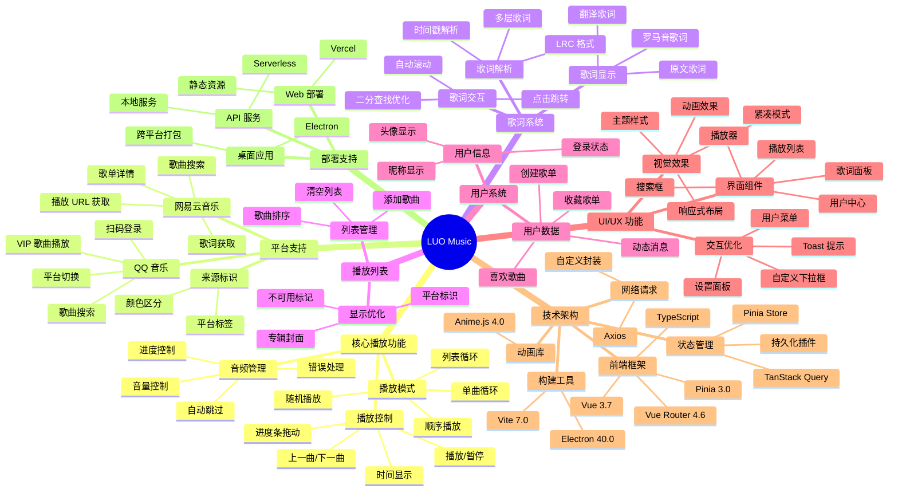

# luo_music

基于 Vue 3 + Pinia + Electron + TypeScript + TanStack Query 的跨平台音乐播放器

[](https://github.com/sansenjian/luo_music/actions/workflows/test.yml)
[](https://codecov.io/gh/sansenjian/luo_music)

> ⚠️ **已知问题**：使用「沉浸式翻译」浏览器插件可能导致歌词不显示。如果遇到歌词不显示的问题，请尝试禁用该插件或将其加入白名单。

## 🎉 最新动态

### v2.2 - Electron-Vite 构建升级 (2026-03-10)
- ✅ **electron-vite 迁移** - 从 electron-builder + tsup 迁移到 electron-vite 方案
- ✅ **TypeScript 测试迁移** - 所有测试文件从 JavaScript 迁移到 TypeScript
- ✅ **构建输出统一** - 所有生产构建产物输出到 `build/` 目录
- ✅ **开发体验优化** - 主进程和渲染进程都支持 HMR 热更新
- ✅ **文档完善** - 新增构建文档和迁移指南（见 [`docs/`](./docs/) 目录）

### v2.1 - 架构升级与优化 (2026-03-04)
- ✅ **TypeScript 迁移** - 音乐平台适配器层全面 TypeScript 化
- ✅ **TanStack Query 引入** - 引入 Vue Query 进行状态管理和数据缓存
- ✅ **测试覆盖提升** - 新增组件和 Store 的单元测试
- ✅ **性能优化** - 用户数据响应式更新，减少不必要的请求

### v2.0 - 双平台支持 (2026-03-01)
- ✅ **QQ 音乐平台支持** - 搜索、播放、歌词一站式体验
- ✅ **平台切换功能** - 搜索框旁可切换网易云/QQ 音乐
- ✅ **扫码登录 QQ 音乐** - 获取 VIP 歌曲播放权限
- ✅ **来源标识** - 歌曲名旁显示平台标签（红色=网易，绿色=QQ）
- ✅ **专辑封面显示** - 播放列表和播放器显示封面
- ✅ **优化 UI 设计** - 自定义下拉框、用户菜单美化

## 🚀 开发计划

- [x] 进度条拖动时实时追踪歌词
- [x] 升级 Vite 到 v7 版本
- [x] 升级 Vue 到 v3.7 版本
- [x] 升级 Node.js 到 v24 版本
- [x] 升级 Electron 到 v40 版本
- [x] 双平台搜索支持（网易云 + QQ 音乐）
- [x] QQ 音乐扫码登录功能
- [x] 播放列表专辑封面显示
- [x] 自定义平台选择下拉框
- [x] 用户头像下拉菜单优化
- [x] 添加功能思维导图
- [x] 引入 TypeScript 支持
- [x] 引入 TanStack Query (Vue Query)
- [ ] 消除翻译歌词不显示问题（QQ 音乐数据源问题）
- [ ] 进行录屏或者截图会出现白屏问题
- [x] 重构 playerStore 消除上帝类问题
- [x] 优化歌词滚动性能

## 功能思维导图



## 功能特性

### P0 核心功能
- ✅ 音乐播放控制（播放/暂停/上一曲/下一曲）
- ✅ 播放进度控制（进度条拖动/时间显示）
- ✅ 歌词实时同步显示（LRC 格式解析）
- ✅ 歌曲搜索（支持网易云音乐 + QQ 音乐）
- ✅ 播放列表管理
- ✅ 平台切换（网易云/QQ 音乐一键切换）

### P1 增强功能
- ✅ 音量控制（持久化、支持拖动）
- ✅ 播放模式切换（顺序/循环/单曲/随机）
- ✅ 多层歌词支持（原文/翻译/罗马音）
- ✅ 歌词点击跳转
- ✅ 歌词自动滚动（二分查找优化）
- ✅ 响应式布局（桌面端/移动端适配）
- ✅ 桌面应用支持（Electron）
- ✅ 按钮动画效果（Anime.js）
- ✅ 进度条拖动定位
- ✅ Web 浏览器支持（Chrome/Edge/Firefox）
- ✅ QQ 音乐扫码登录
- ✅ 专辑封面显示
- ✅ 来源标识（平台标签）
- ✅ 登录状态检测

## 技术栈

| 技术 | 版本 | 用途 |
|------|------|------|
| Vue | 3.7+ | 前端框架 |
| TypeScript | 5.0+ | 静态类型检查 |
| Electron | 40.0+ | 桌面应用框架 |
| Pinia | 3.0+ | 状态管理 |
| TanStack Query | 5.0+ | 服务端状态管理 |
| Pinia Plugin Persistedstate | 4.7+ | 状态持久化 |
| Axios | 1.6+ | HTTP 客户端 |
| Vite | 7.0+ | 构建工具 |
| Anime.js | 4.0+ | 动画效果 |
| NeteaseCloudMusicApi Enhanced | 4.30+ | 网易云音乐 API |
| QQ Music API | - | QQ 音乐 API 服务 |

## 依赖结构说明

项目采用**依赖分离**策略，优化 Web 部署体积：

```json
{
  "dependencies": {
    // 纯 Web 依赖 - Vercel 部署时安装
    "vue": "^3.7.0",
    "pinia": "^3.0.4",
    "animejs": "^4.3.6",
    "@tanstack/vue-query": "^5.0.0"
    // ...
  },
  "devDependencies": {
    // Electron 专属依赖 - 仅开发/打包时安装
    "electron": "^40.0.0",
    "electron-builder": "^25.1.8",
    "vite-plugin-electron": "^0.29.0",
    "typescript": "^5.0.0",
    "vue-tsc": "^2.0.0"
    // ...
  }
}
```

### 为什么这样设计？

| 场景 | 安装命令 | 安装的依赖 |
|------|----------|-----------|
| **本地开发** | `npm install` | 全部依赖 |
| **Electron 打包** | `npm install` | 全部依赖 |
| **Vercel Web 部署** | `npm install --production` | 仅 dependencies |

### 安装 Electron 相关依赖

```bash
# 安装 Electron（开发依赖）
npm install -D electron

# 安装 Electron 打包工具
npm install -D electron-builder

# 安装 Vite Electron 插件
npm install -D vite-plugin-electron vite-plugin-electron-renderer
```

> **注意**：Electron 相关包必须放在 `devDependencies` 中，否则 Vercel 部署时会安装不必要的依赖，导致部署失败或体积过大。

## 项目结构

```
luo_music/
├── docs/             # 项目文档 (VitePress)
│   ├── build.md      # 构建文档
│   ├── testing.md    # 测试文档
│   ├── api-documentation.md
│   └── ...
├── electron/         # Electron 主进程代码
│   ├── main.ts       # 主进程入口
│   ├── preload.js    # 预加载脚本
│   ├── ipc.ts        # IPC 通信
│   ├── WindowManager.ts
│   ├── ServerManager.ts
│   └── utils/paths.ts
├── scripts/          # 构建脚本
│   ├── dev/          # 开发脚本
│   └── utils/        # 工具脚本
├── server/           # API 服务端
│   └── index.ts
├── src/
│   ├── api/          # API 接口层 (Axios + TypeScript)
│   ├── assets/       # 静态资源（CSS/字体）
│   ├── base/         # 基础架构 (事件/生命周期)
│   ├── components/   # Vue 组件
│   ├── composables/  # 组合式函数
│   ├── platform/     # 平台适配层 (TypeScript)
│   │   ├── music/    # 音乐平台适配器
│   │   ├── electron/ # Electron 平台服务
│   │   └── web/      # Web 平台服务
│   ├── router/       # 路由配置
│   ├── store/        # Pinia 状态管理
│   ├── types/        # TypeScript 类型定义
│   ├── utils/        # 工具函数
│   │   ├── http/     # HTTP 请求封装
│   │   ├── error/    # 错误处理
│   │   └── player/   # 播放器模块
│   ├── views/        # 页面视图
│   ├── App.vue       # 根组件
│   └── main.js       # 入口文件
├── tests/            # 测试目录
│   ├── base/         # 基础架构测试
│   ├── components/   # 组件测试
│   ├── electron/     # Electron 测试
│   ├── store/        # Store 测试
│   └── utils/        # 工具函数测试
├── build/            # 构建输出目录
├── package.json
├── vite.config.ts
├── electron.vite.config.ts
├── forge.config.ts
├── tsconfig.json
└── index.html
```

## 环境支持

本项目支持三种运行环境：

| 环境 | 适用场景 | API 服务 | 部署方式 |
|------|----------|----------|----------|
| **Web 开发** | 本地开发调试（Chrome/Edge/Firefox） | 本地 Node.js 服务 | `npm run dev` |
| **Electron 桌面** | Windows/Mac/Linux 桌面应用 | 内置/本地服务 | `npm run dev` 或 `npm run dev:electron` |
| **Vercel 线上** | 线上 Web 访问 | Vercel Serverless Function | 自动部署 |

## 快速开始

### 环境要求
- Node.js 24+
- npm 10+

### 安装依赖

```bash
cd luo_music
npm install
```

### NPM 脚本命令

```bash
# 开发模式
npm run dev              # 全部开发（API 服务器 + Vite）
npm run dev:web          # 仅 Web 开发（Vite）
npm run dev:electron     # Electron 开发（桌面应用）

# 生产构建
npm run build:web        # 输出 dist/ → 部署到 Vercel
npm run build:electron   # 输出 dist/ + release/ → 本地安装包

# 其他命令
npm run preview          # 预览构建结果
npm run test             # 运行测试
npm run clean            # 清理构建产物
```

---

## 🌐 Web 开发环境

### 启动开发服务器

**方式一：全部启动（推荐）**
```bash
npm run dev
```
同时启动：
- NeteaseCloudMusicApi 服务（端口 14532）
- Vite 开发服务器（端口 5173）

**方式二：仅启动前端**
```bash
npm run dev:web
```
仅启动 Vite 开发服务器，需要单独启动 API 服务或使用远程 API。

**方式三：分别启动（调试时使用）**
```bash
# 终端 1：启动 API 服务 (端口 14532)
npm run server

# 终端 2：启动前端开发服务器 (端口 5173)
npm run dev:web
```

### 构建 Web 版本

```bash
npm run build:web
```

构建输出目录：`dist/`

---

## 💻 Electron 桌面环境

### 开发模式

```bash
npm run dev:electron
```

启动内容：
- NeteaseCloudMusicApi 服务（端口 14532）
- Vite 开发服务器（端口 5173）
- Electron 桌面应用窗口

**特性**：
- ✅ **HMR 热更新** - 主进程和渲染进程都支持热更新
- ✅ **自动重启** - 主进程代码修改后自动重启
- ✅ **更好的 sourcemap** - 开发调试更方便

### 构建桌面应用

```bash
# 构建 Electron 应用（包含打包）
npm run build:electron

# 仅构建，不打包（输出到 release/ 目录）
npm run build:electron:dir

# 快速构建（仅打包，用于测试）
npm run build:fast
```

构建输出目录：
- `build/` - 构建产物（前端 + Electron 主进程）
- `release/` - 打包后的安装包

### Electron 特性

- **窗口控制**：支持最小化、最大化、关闭
- **紧凑模式**：按 ESC 键切换迷你播放器
- **缓存管理**：在设置中清理 Cookies 和缓存数据
- **系统托盘**：最小化到托盘
- **全局快捷键**：支持媒体键控制

### 构建系统迁移

项目已从 `electron-builder + tsup` 迁移到 `electron-vite` 方案。详见 [`docs/build.md`](./docs/build.md)。

## 📚 文档

更多文档请访问 [`docs/`](./docs/) 目录：

- [快速开始](./docs/GETTING_STARTED.md) - 项目入门指南
- [构建文档](./docs/build.md) - 构建产物管理与部署
- [API 文档](./docs/api-documentation.md) - API 接口说明
- [组件文档](./docs/components-documentation.md) - 组件使用说明
- [测试文档](./docs/testing.md) - 测试策略与用例
- [错误处理](./docs/error-handling.md) - 错误处理规范

---

## ☁️ Vercel 线上部署

### 自动部署

1. Fork 本项目到 GitHub
2. 在 Vercel 导入项目
3. 配置环境变量（可选）：
   - `VITE_API_BASE_URL` - API 基础 URL（默认使用 Vercel Serverless Function）
4. 部署完成

### Vercel 配置说明

项目已配置好 `vercel.json`，包含：
- API 路由重写（`/api/*` → Serverless Function）
- CORS 跨域支持
- 静态资源缓存策略
- 10 秒函数执行时间限制

### 本地预览 Vercel 构建

```bash
# 安装 Vercel CLI
npm i -g vercel

# 本地预览
vercel dev
```

---

## ⚙️ 环境变量配置

创建 `.env` 文件（开发环境）：

```bash
# API 基础 URL
# Web 开发：http://localhost:14532
# Vercel 部署：/api（使用相对路径）
VITE_API_BASE_URL=http://localhost:14532

# 开发服务器端口
VITE_DEV_SERVER_PORT=5173
```

---

## 🔌 API 说明

### 本地开发

内置网易云音乐 API 服务（基于 `NeteaseCloudMusicApi Enhanced`），默认运行在 `http://localhost:14532`。

### Vercel 部署

使用 Serverless Function 运行 API，路径为 `/api/*`。

### 主要 API 端点

#### 网易云音乐
| 端点 | 说明 |
|------|------|
| `/search` | 歌曲搜索 |
| `/cloudsearch` | 歌曲搜索（更全） |
| `/song/url/v1` | 获取音乐 URL |
| `/lyric` | 获取歌词 |
| `/song/detail` | 歌曲详情 |
| `/playlist/detail` | 歌单详情 |

#### QQ 音乐
| 端点 | 说明 |
|------|------|
| `/getSearchByKey` | 歌曲搜索 |
| `/getMusicPlay` | 获取播放链接 |
| `/getLyric` | 获取歌词 |
| `/getQQLoginQr` | 获取登录二维码 |
| `/checkQQLoginQr` | 检查登录状态 |
| `/user/getCookie` | 获取 Cookie |

---

## 🎨 设计风格

采用工业风设计：
- **背景色**: 米白色 (#f5f5f0)
- **强调色**: 橙色 (#ff6b35)
- **边框**: 粗黑边框 (2px solid)
- **字体**: Inter + Noto Sans SC + JetBrains Mono

---

## 💾 状态持久化

以下状态会自动持久化到 localStorage：
- `volume` - 音量设置
- `playMode` - 播放模式
- `lyricType` - 歌词显示类型
- `isCompact` - 紧凑模式状态

**注意**：播放列表和当前索引不持久化，避免 URL 过期问题。

---

## 🐛 常见问题

### Q: 搜索提示 "Search failed. Please check your connection"
**A**: 检查 API 服务是否启动：`npm run server`。如果是 502 错误，可能是网易云音乐服务暂时不可用，请稍后重试。

### Q: 歌词不显示或不滚动
**A**: 
1. 检查是否有「沉浸式翻译」等浏览器插件干扰
2. 歌词解析支持标准 LRC 格式，包括 `[00:00.00]` 和 `[00:00:00]` 两种时间戳格式
3. 确保歌曲有歌词数据

### Q: QQ 音乐搜索不到歌曲或播放失败
**A**: 
1. 确认 QQ 音乐 API 服务已启动（端口 3200）
2. 检查是否有版权或 VIP 限制
3. 尝试使用更高品质（如 320k 或 m4a）
4. 部分歌曲需要登录后才能播放

### Q: 无法播放 VIP 歌曲
**A**: 
1. 登录 QQ 音乐获取播放权限
2. 点击右上角头像 → "QQ 音乐登录" → 扫码登录
3. 登录成功后 cookie 会自动保存，下次启动无需重复登录

### Q: Electron 应用无法播放音乐
**A**: 检查 `webSecurity` 设置，确保音频跨域配置正确。如果提示 `preload.cjs` 缺失，需要重新构建：`npm run build`。

### Q: Vercel 部署后 API 超时
**A**: Vercel 免费版函数执行时间限制为 10 秒，部分 API 可能需要重试。

### Q: Vercel 部署时如何跳过测试依赖安装？
**A**: 在 Vercel Dashboard 中配置：
1. 进入项目 → **Settings** → **General**
2. 找到 **Build & Development Settings**
3. 修改 **Install Command** 为：`npm install --production`
4. 或添加环境变量：`NODE_ENV = production`

这样 Vercel 只会安装 `dependencies` 中的依赖，跳过 `devDependencies` 中的测试工具（如 Playwright、Vitest 等），加快部署速度。

### Q: 安装依赖时提示 EBUSY 错误
**A**: 文件被占用，请关闭所有 Node.js 和 Electron 进程，或重启电脑后重试。

---

## ☕ 支持开发

如果这个项目帮到了你，可以考虑赞助支持：

**luo 音乐 API 作者 (sansenjian)**：
- [爱发电 - @sansenjian](https://ifdian.net/a/sansenjian)

你的支持将用于：
- 维护网易云/QQ 音乐 API 接口
- 开发更多功能
- 持续优化播放器体验

---

## 📚 参考资料

- [Hydrogen Music](https://github.com/Kaidesuyo/Hydrogen-Music) - 参考架构设计
- [NeteaseCloudMusicApi Enhanced](https://github.com/NeteaseCloudMusicApiEnhanced/api-enhanced) - 网易云音乐 API（增强版，持续维护）
- [QQ Music API](https://github.com/sansenjian/qq-music-api) - QQ 音乐 API 服务（sansenjian 版本）
- [Electron 文档](https://www.electronjs.org/)
- [Vue 3 文档](https://vuejs.org/)
- [Vercel 文档](https://vercel.com/docs)
