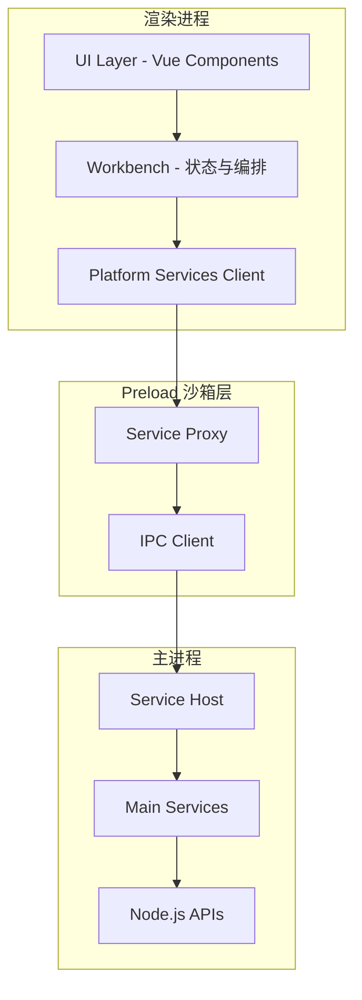

# 架构改进计划：借鉴 VSCode 分层架构

## 1. 现状分析

### 1.1 当前项目结构

```
luo_music_new/
├── src/
│   ├── api/              # 音乐平台接口封装
│   ├── platform/         # 平台抽象层（基础实现）
│   │   ├── core/         # 核心适配器
│   │   └── music/        # 音乐平台适配
│   ├── store/            # Pinia 状态管理
│   ├── composables/      # 组合式函数
│   ├── utils/            # 工具函数
│   ├── components/       # UI 组件
│   └── views/            # 页面视图
├── electron/             # Electron 主进程
│   ├── main.ts           # 主入口
│   ├── preload.js        # 预加载脚本
│   └── *.ts              # 各功能模块
└── server.ts             # API 服务端
```

### 1.2 VSCode 目标结构（借鉴参考）

```
src/vs/
├── base/                 # 基础工具库
│   ├── common/           # 平台无关代码
│   └── node/             # Node.js 特定代码
├── platform/             # 平台抽象层
│   ├── common/           # 通用接口定义
│   └── electron-main/    # Electron 主进程实现
├── code/                 # Electron 入口
│   ├── electron-main/    # 主进程代码
│   ├── electron-sandbox/ # 渲染进程预加载层
│   └── node/             # 共享进程代码
└── workbench/            # UI 框架
```

### 1.3 差距分析

| 维度 | 当前状态 | VSCode 模式 | 改进方向 |
|------|----------|-------------|----------|
| 事件系统 | 无统一抽象 | EventEmitter + Disposable | 创建 base/common/event 模块 |
| 生命周期 | 无统一管理 | Disposable 模式 | 引入资源自动释放机制 |
| 平台服务 | 简单适配器模式 | 服务接口 + 依赖注入 | 增强 platform 层抽象 |
| IPC 通信 | 直接暴露 API | Protocol + Channel 抽象 | 创建 IPC 服务层 |
| Electron 分层 | 单层 preload | electron-main/sandbox/node 三层 | 重构为三层架构 |
| 配置管理 | 无统一方案 | IConfigurationService | 创建配置服务抽象 |
| 日志系统 | electron-log 直接调用 | ILogService 抽象 | 创建日志服务接口 |

---

## 2. 目标架构设计

### 2.1 整体架构图



### 2.2 目录结构规划

```
luo_music_new/
├── src/
│   ├── base/                      # [新增] 基础工具库
│   │   ├── common/                # 平台无关代码
│   │   │   ├── event/             # 事件系统
│   │   │   ├── lifecycle/         # 生命周期管理
│   │   │   ├── types/             # 基础类型
│   │   │   └── utils/             # 通用工具
│   │   └── node/                  # Node.js 特定代码
│   │       └── fileSystem/        # 文件系统工具
│   │
│   ├── platform/                  # [增强] 平台抽象层
│   │   ├── common/                # 服务接口定义
│   │   │   ├── config/            # 配置服务接口
│   │   │   ├── log/               # 日志服务接口
│   │   │   ├── storage/           # 存储服务接口
│   │   │   └── ipc/               # IPC 服务接口
│   │   ├── electron/              # Electron 平台实现
│   │   │   └── services/          # Electron 特定服务
│   │   └── web/                   # Web 平台实现
│   │       └── services/          # Web 特定服务
│   │
│   ├── api/                       # [保持] 音乐平台接口
│   ├── store/                     # [保持] 状态管理
│   ├── composables/               # [保持] 组合式函数
│   ├── utils/                     # [整合] 部分迁移到 base
│   ├── components/                # [保持] UI 组件
│   └── views/                     # [保持] 页面视图
│
├── electron/                      # [重构] 三层架构
│   ├── main/                      # 主进程代码
│   │   ├── app.ts                 # 应用入口
│   │   ├── services/              # 主进程服务
│   │   └── ipc/                   # IPC 处理器
│   ├── sandbox/                   # Preload 沙箱层
│   │   ├── index.ts               # 入口
│   │   └── services/              # 沙箱服务代理
│   └── shared/                    # 共享代码
│       ├── types/                 # 共享类型
│       └── protocol/              # IPC 协议定义
│
└── server/                     # [已完成] API 服务端（已迁移到独立目录）
    └── index.ts
```

---

## 3. 分阶段实施计划

### Phase 1: 基础工具库抽象层 (src/base/)

**目标**：创建平台无关的基础设施代码，提供统一的事件、生命周期和类型定义。

#### 1.1 事件系统 (EventEmitter)

```typescript
// src/base/common/event/event.ts
export interface Event<T> {
  (listener: (e: T) => any): IDisposable;
}

export class EventEmitter<T> {
  private listeners: ((e: T) => void)[] = [];
  
  get event(): Event<T> {
    return (listener) => {
      this.listeners.push(listener);
      return { dispose: () => this.removeListener(listener) };
    };
  }
  
  fire(data: T): void {
    this.listeners.forEach(l => l(data));
  }
  
  dispose(): void {
    this.listeners = [];
  }
}
```

#### 1.2 生命周期管理 (Disposable)

```typescript
// src/base/common/lifecycle/disposable.ts
export interface IDisposable {
  dispose(): void;
}

export class Disposable implements IDisposable {
  private disposed = false;
  private disposables: IDisposable[] = [];
  
  register<T extends IDisposable>(d: T): T {
    if (this.disposed) {
      d.dispose();
    } else {
      this.disposables.push(d);
    }
    return d;
  }
  
  dispose(): void {
    if (!this.disposed) {
      this.disposables.forEach(d => d.dispose());
      this.disposables = [];
      this.disposed = true;
    }
  }
}
```

#### 1.3 任务清单

- [x] 创建 `src/base/common/event/` 目录及事件系统实现
- [x] 创建 `src/base/common/lifecycle/` 目录及 Disposable 实现
- [x] 创建 `src/base/common/types/` 目录及基础类型定义
- [ ] 创建 `src/base/common/utils/` 目录，迁移通用工具函数
- [x] 为新增模块编写单元测试（25 个测试用例通过）

---

### Phase 2: 平台服务抽象层增强 (src/platform/)

**目标**：定义平台无关的服务接口，实现 Electron 和 Web 两种平台的具体实现。

#### 2.1 服务接口定义

```typescript
// src/platform/common/log/log.ts
export interface ILogService {
  info(message: string, ...args: any[]): void;
  warn(message: string, ...args: any[]): void;
  error(message: string, ...args: any[]): void;
  debug(message: string, ...args: any[]): void;
}

// src/platform/common/config/config.ts
export interface IConfigurationService {
  get<T>(key: string): T | undefined;
  get<T>(key: string, defaultValue: T): T;
  set(key: string, value: any): Promise<void>;
  onDidChange: Event<string>;
}

// src/platform/common/storage/storage.ts
export interface IStorageService {
  get(key: string): string | undefined;
  set(key: string, value: string): void;
  delete(key: string): void;
  clear(): void;
}
```

#### 2.2 IPC 服务抽象

```typescript
// src/platform/common/ipc/ipc.ts
export interface IIPCService {
  invoke<T>(channel: string, ...args: any[]): Promise<T>;
  send(channel: string, ...args: any[]): void;
  on(channel: string, listener: (...args: any[]) => void): IDisposable;
}
```

#### 2.3 任务清单

- [x] 创建 `src/platform/common/` 目录结构
- [x] 定义 IPlatformService 接口（包含 IWindowService、ICacheService、IIPCService、IPlatformInfoService）
- [x] 实现 PlatformServiceBase 基类
- [x] 实现 ElectronPlatformService（Electron 平台实现）
- [x] 实现 WebPlatformService（Web 平台实现）
- [x] 创建 PlatformServiceRegistry 服务注册表
- [x] 重构现有 PlatformAdapter 使用新服务接口
- [x] 编写服务接口的单元测试（18 个测试用例通过）

---

### Phase 3: Electron 三层架构重构

**目标**：将 Electron 代码重构为 electron-main/electron-sandbox/node 三层架构。

#### 3.1 架构分层说明

```
┌─────────────────────────────────────────────────────────────┐
│                     渲染进程 (Renderer)                      │
│  ┌─────────────┐  ┌─────────────┐  ┌─────────────┐          │
│  │  Vue App    │  │  Services   │  │   Store     │          │
│  └──────┬──────┘  └──────┬──────┘  └──────┬──────┘          │
└─────────┼────────────────┼────────────────┼─────────────────┘
          │                │                │
          ▼                ▼                ▼
┌─────────────────────────────────────────────────────────────┐
│                    Preload 沙箱层 (Sandbox)                  │
│  ┌──────────────────────────────────────────────────────┐   │
│  │              contextBridge.exposeInMainWorld          │   │
│  │  ┌────────────┐ ┌────────────┐ ┌────────────┐        │   │
│  │  │ LogProxy   │ │ ConfigProxy│ │ IPCProxy   │        │   │
│  │  └────────────┘ └────────────┘ └────────────┘        │   │
│  └──────────────────────────────────────────────────────┘   │
└─────────────────────────────────────────────────────────────┘
          │                │                │
          ▼                ▼                ▼
┌─────────────────────────────────────────────────────────────┐
│                    主进程 (Main Process)                     │
│  ┌─────────────┐  ┌─────────────┐  ┌─────────────┐          │
│  │ LogService  │  │ ConfigSvc   │  │ IPCService  │          │
│  └─────────────┘  └─────────────┘  └─────────────┘          │
│  ┌──────────────────────────────────────────────────────┐   │
│  │              Node.js APIs / Electron APIs             │   │
│  └──────────────────────────────────────────────────────┘   │
└─────────────────────────────────────────────────────────────┘
```

#### 3.2 目录结构

```
electron/
├── main/                          # 主进程代码
│   ├── app.ts                     # 应用入口
│   ├── windowManager.ts           # 窗口管理
│   ├── services/                  # 主进程服务
│   │   ├── logService.ts          # 日志服务实现
│   │   ├── configService.ts       # 配置服务实现
│   │   ├── cacheService.ts        # 缓存服务
│   │   └── downloadService.ts     # 下载服务
│   └── ipc/                       # IPC 处理器
│       ├── handlers/              # 各类处理器
│       └── protocol.ts            # 协议定义
│
├── sandbox/                       # Preload 沙箱层
│   ├── index.ts                   # 入口
│   ├── services/                  # 服务代理
│   │   ├── logProxy.ts            # 日志服务代理
│   │   ├── configProxy.ts         # 配置服务代理
│   │   └── ipcProxy.ts            # IPC 服务代理
│   └── validation.ts              # 通道验证
│
└── shared/                        # 共享代码
    ├── types/                     # 共享类型定义
    │   ├── services.ts            # 服务类型
    │   └── ipc.ts                 # IPC 类型
    └── protocol/                  # IPC 协议
        └── channels.ts            # 通道常量定义
```

#### 3.3 IPC 协议定义

```typescript
// electron/shared/protocol/channels.ts
export const IPC_CHANNELS = {
  // 日志
  LOG_INFO: 'log:info',
  LOG_WARN: 'log:warn',
  LOG_ERROR: 'log:error',
  
  // 配置
  CONFIG_GET: 'config:get',
  CONFIG_SET: 'config:set',
  CONFIG_ON_CHANGE: 'config:onChange',
  
  // 缓存
  CACHE_GET_SIZE: 'cache:getSize',
  CACHE_CLEAR: 'cache:clear',
  
  // 窗口
  WINDOW_MINIMIZE: 'window:minimize',
  WINDOW_MAXIMIZE: 'window:maximize',
  WINDOW_CLOSE: 'window:close',
} as const;
```

#### 3.4 任务清单

- [ ] 创建 `electron/main/` 目录结构
- [ ] 创建 `electron/sandbox/` 目录结构
- [ ] 创建 `electron/shared/` 目录及协议定义
- [ ] 实现 IPC 服务代理层
- [ ] 迁移现有 IPC 处理器到新架构
- [ ] 迁移 WindowManager 到新架构
- [ ] 迁移各功能模块（ServerManager, DesktopLyricManager 等）
- [ ] 更新 preload.js 到 TypeScript
- [ ] 更新构建配置支持新目录结构

---

### Phase 4: 验证与测试

**目标**：确保架构改进后功能正常，性能稳定。

#### 4.1 测试策略

1. **单元测试**
   - base/common 模块 100% 覆盖
   - platform 服务接口 Mock 测试
   - IPC 协议编解码测试

2. **集成测试**
   - Electron 主进程服务集成测试
   - Preload 沙箱层通信测试
   - 端到端功能测试

3. **回归测试**
   - 运行现有测试套件
   - 手动验证核心功能

#### 4.2 任务清单

- [ ] 编写 base/common 模块单元测试
- [ ] 编写 platform 服务接口测试
- [ ] 编写 IPC 通信集成测试
- [ ] 运行完整测试套件确保无回归
- [ ] 执行 `pnpm build:web` 验证 Web 构建
- [ ] 执行 `pnpm build:electron` 验证 Electron 构建
- [ ] 手动测试核心功能

---

## 4. 风险与缓解措施

| 风险 | 影响 | 缓解措施 |
|------|------|----------|
| 构建配置变更导致打包失败 | 高 | 分步迁移，每步验证构建 |
| IPC 重构导致通信中断 | 高 | 保持向后兼容，逐步替换 |
| TypeScript 迁移引入类型错误 | 中 | 严格类型检查，逐步收紧 |
| 性能回归 | 中 | 关键路径性能测试 |

---

## 5. 实施顺序建议

1. **先基础设施**：Phase 1 完成后再进行 Phase 2
2. **渐进式重构**：Phase 3 可以在 Phase 2 部分完成后并行开始
3. **持续验证**：每个 Phase 完成后运行完整测试

---

## 6. 附录：VSCode 架构参考

### 6.1 核心设计原则

1. **依赖注入（DI）**：服务通过接口注入，便于测试和替换
2. **Disposable 模式**：资源自动释放，避免内存泄漏
3. **事件驱动**：模块间通过事件通信，降低耦合
4. **分层架构**：渲染进程、沙箱层、主进程严格分离
5. **服务抽象**：平台无关的接口，平台特定的实现

### 6.2 关键模式

- **Service Pattern**：统一的服务生命周期管理
- **Proxy Pattern**：Preload 层作为主进程服务的代理
- **Observer Pattern**：事件订阅发布机制
- **Factory Pattern**：服务的延迟初始化和依赖管理