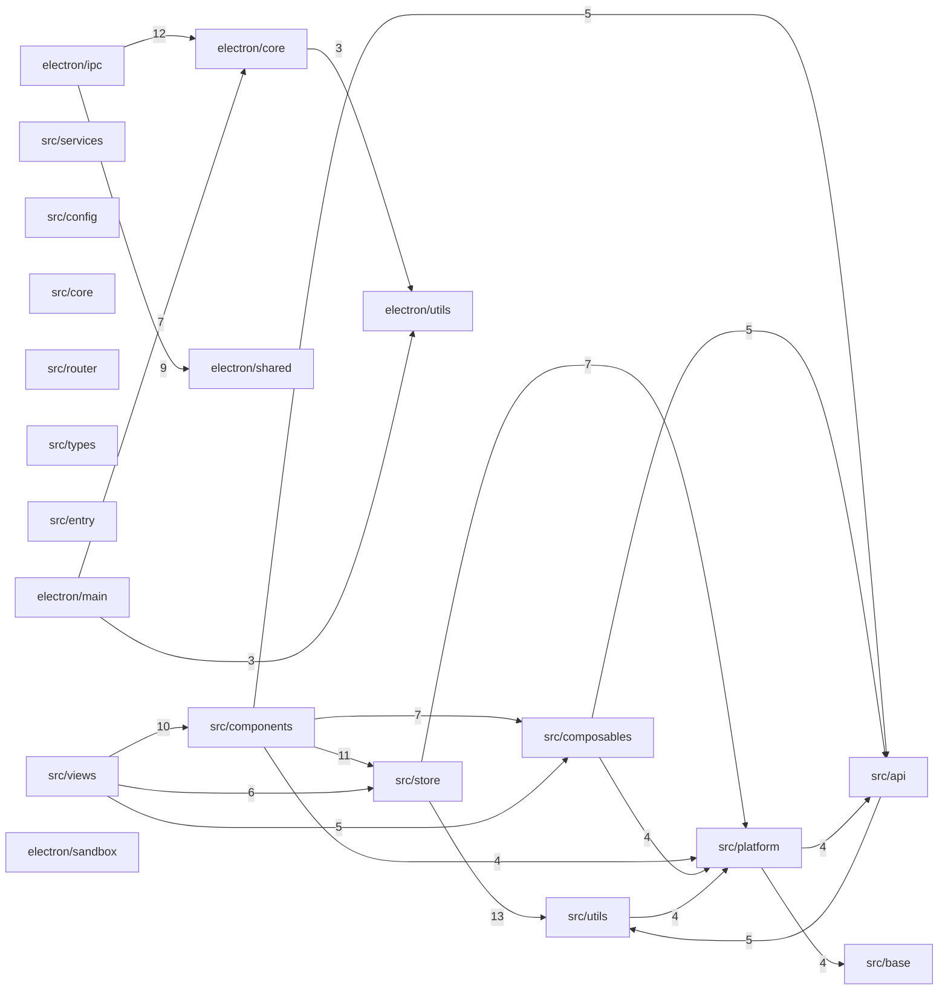

# Lightweight Dependency Graph

Generated: 2026-03-15T09:25:48.728Z

## Scope

- Scanned files: 162
- Module groups: 20
- Cross-group import edges: 47

## Groups

- src/views
- src/components
- src/composables
- src/store
- src/services
- src/platform
- src/api
- src/utils
- src/base
- src/config
- src/core
- src/router
- src/types
- src/entry
- electron/main
- electron/ipc
- electron/shared
- electron/sandbox
- electron/utils
- electron/core

## Mermaid

## Top Cross-Group Edges

- src/store -> src/utils (13)
- electron/ipc -> electron/core (12)
- src/components -> src/store (11)
- src/views -> src/components (10)
- electron/ipc -> electron/shared (9)
- electron/main -> electron/core (7)
- src/components -> src/composables (7)
- src/store -> src/platform (7)
- src/views -> src/store (6)
- src/api -> src/utils (5)
- src/components -> src/api (5)
- src/composables -> src/api (5)
- src/views -> src/composables (5)
- src/components -> src/platform (4)
- src/composables -> src/platform (4)
- src/platform -> src/api (4)
- src/platform -> src/base (4)
- src/utils -> src/platform (4)
- electron/core -> electron/utils (3)
- electron/main -> electron/utils (3)

## Potential Architecture Smells

- [UI -> Platform] src/components/CacheManager.vue -> src/platform/index.ts (src/components -> src/platform)
- [UI -> Platform] src/components/LyricFloat.vue -> src/platform/index.ts (src/components -> src/platform)
- [UI -> Platform] src/components/SettingsPanel.vue -> src/platform/index.ts (src/components -> src/platform)
- [UI -> Platform] src/components/UserAvatar.vue -> src/platform/index.ts (src/components -> src/platform)
- [UI -> Platform] src/views/Home.vue -> src/platform/index.ts (src/views -> src/platform)
