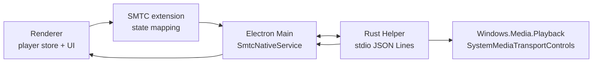

# Windows 原生 SMTC 与包化实现计划

## 决策

Luo Music 的 Windows SMTC 先按 **Rust native helper + TypeScript Electron wrapper** 实现。成熟后抽成独立 npm 包，目标形态接近 `electron-windows-media`，但不使用 N-API addon 作为第一方案。

当前选择：

- 原生层：Rust helper，可直接调用 WinRT `Windows.Media.Playback`。
- Electron 层：TypeScript wrapper，负责 helper 生命周期、IPC、回退和对外 API。
- 通信：第一版使用 stdio JSON Lines；稳定后再评估 named pipe。
- 回退：Windows native helper 不可用时回退现有 Chromium `navigator.mediaSession`。
- 发布目标：先内置在 Luo Music 验证，再抽成可复用 npm 包。

不选择 Node 原生 addon 的原因：

- Electron / Node ABI 与 native addon 打包会增加维护成本。
- helper 崩溃不会拖垮 Electron 主进程，容错更清晰。
- helper 进程模型未来可以复用到 WASAPI exclusive 等原生能力。

不选择 Go 的原因：

- Go 做普通 helper 可行，但 WinRT / COM 事件模型没有 Rust `windows` crate 这类成熟投影。
- SMTC 需要长期维护按钮事件、timeline、封面 stream、线程模型，Rust 更合适。

## 背景

当前 `builtin.smtc` 使用 Chromium `navigator.mediaSession`。这个方案成本低，可以覆盖基础媒体键和 Windows 媒体面板，但稳定性受 Chromium 对 `<audio>` 元素、音频输出路径和 renderer 生命周期的影响。切歌、修改 `audio.src`、Web Audio 可视化 fallback、renderer reload 都可能让 Windows 看到空 session、旧 metadata 或短暂丢失控制按钮。

对比 [inflink-rs](https://github.com/apoint123/inflink-rs) 后可以确认，它的稳定性来自原生 Windows Runtime 路径：Rust 后端创建 `MediaPlayer`，直接取得 `SystemMediaTransportControls`，再用 WinRT API 更新 metadata、timeline、playback state 和按钮事件。

## 目标

- Windows Electron 端提供稳定的原生 SMTC session。
- 播放、暂停、上一首、下一首、停止、seek、随机、循环状态由原生层直接暴露给 Windows。
- renderer / player store 仍是播放事实来源；原生层只负责系统集成，不直接播放音频。
- Web、macOS、Linux 继续使用现有 MediaSession / 平台 fallback。
- 代码边界从第一天开始按可抽包设计，避免把 Luo Music store 和业务逻辑写进原生层。

## 非目标

- 不实现 WASAPI exclusive 输出。它属于第一方音频输出插件路线。
- 不在 helper 内解码或播放音频。
- 不把歌词、播放队列、音乐服务 API 放入 SMTC 包。
- 第一版不做 Linux MPRIS / macOS Now Playing Center。

## 参考实现差异

| 能力         | inflink-rs                                        | 当前 Luo Music                    | 目标方案                             |
| ------------ | ------------------------------------------------- | --------------------------------- | ------------------------------------ |
| SMTC session | Rust `MediaPlayer.SystemMediaTransportControls()` | Chromium `navigator.mediaSession` | Rust helper 持有原生 SMTC session    |
| runtime 开关 | `smtc.SetIsEnabled()`                             | renderer cleanup + audio exposure | `EnableSmtc` / `DisableSmtc` command |
| metadata     | `DisplayUpdater().MusicProperties()`              | `MediaMetadata`                   | `UpdateMetadata` command             |
| 封面         | URL / base64 -> `RandomAccessStreamReference`     | URL / data URL 交给 Chromium      | URL / base64 -> WinRT stream         |
| timeline     | `SystemMediaTransportControlsTimelineProperties`  | `setPositionState()`              | `UpdateTimeline` command             |
| 控制事件     | WinRT event -> JS callback                        | `setActionHandler()`              | helper event -> Electron callback    |
| 生命周期     | 后端持有 `SmtcContext`                            | Vue composable 持有 session       | 主进程 wrapper 管理 helper 进程      |

## 最终包形态

成熟后的仓库可以是独立 repo，也可以先放在 monorepo 内。推荐结构：

```txt
electron-native-smtc/
  packages/
    electron-native-smtc/          # 主 npm 包，TypeScript API
    smtc-helper-win32-x64-msvc/    # Windows x64 helper binary
    smtc-helper-win32-arm64-msvc/  # Windows arm64 helper binary
  crates/
    smtc-helper/                   # Rust 原生 helper
```

主包职责：

- 启动、停止和重启 helper。
- 解析 packaged / dev 环境下的 helper 路径。
- 提供 metadata、playback state、timeline、play mode 更新 API。
- 把 helper 事件转成 TypeScript callback / EventEmitter。
- 处理 helper crash、超时、不可用回退。
- 提供 Electron Builder / Forge 打包说明。

主包不包含：

- 播放队列。
- Vue / React store 绑定。
- 音频解码或输出。
- 歌词系统。
- 具体音乐平台字段。

### npm API 草案

```ts
import { createSmtcSession } from 'electron-native-smtc/main'

const smtc = createSmtcSession({
  appName: 'Luo Music',
  logger: console,
  onCommand(command) {
    switch (command.type) {
      case 'play':
        win.webContents.send('player:play')
        break
      case 'pause':
        win.webContents.send('player:pause')
        break
      case 'nextTrack':
        win.webContents.send('player:next')
        break
    }
  }
})

await smtc.enable()

smtc.updateMetadata({
  title: 'Track',
  artist: 'Artist',
  album: 'Album',
  artworkUrl: 'https://example.com/cover.jpg',
  durationMs: 180000
})

smtc.updatePlaybackState('playing')
smtc.updateTimeline({ positionMs: 42000, durationMs: 180000 })
```

## Luo Music 内部落地边界

在抽包前，先按未来包边界写在项目里：

```txt
native/smtc-helper/
packages/shared/smtc/protocol.ts
electron/main/smtcNativeService.ts
src/extensions/smtc/
```

边界规则：

- `native/smtc-helper/` 不知道 Luo Music。
- `packages/shared/smtc/protocol.ts` 只放协议类型，不依赖 Vue / Electron。
- `electron/main/smtcNativeService.ts` 只管理 helper，不读 player store。
- `src/extensions/smtc/` 负责把 player store 状态映射成标准 SMTC command。
- 当前 `useMediaSession` 保留为 fallback，不删除。

## 架构



## 命令协议

```ts
type SmtcCommand =
  | { type: 'initialize' }
  | { type: 'enable' }
  | { type: 'disable' }
  | {
      type: 'metadata'
      payload: {
        title: string
        artist?: string
        album?: string
        artworkUrl?: string
        artworkBase64?: string
        sourceId?: string | number
        durationMs?: number
      }
    }
  | { type: 'playbackState'; payload: { state: 'playing' | 'paused' | 'stopped' } }
  | { type: 'timeline'; payload: { positionMs: number; durationMs: number } }
  | {
      type: 'playMode'
      payload: { shuffle: boolean; repeat: 'none' | 'track' | 'list' }
    }
  | { type: 'shutdown' }
```

```ts
type SmtcEvent =
  | { type: 'play' }
  | { type: 'pause' }
  | { type: 'stop' }
  | { type: 'nextTrack' }
  | { type: 'previousTrack' }
  | { type: 'seek'; positionMs: number }
  | { type: 'toggleShuffle' }
  | { type: 'toggleRepeat' }
  | { type: 'error'; message: string }
```

## 阶段计划

### Phase 0：稳定现有 Chromium 后端

已执行方向：

- Chromium MediaSession feature 保持常开，插件开关不再依赖 relaunch。
- 启用 SMTC 时先写 metadata、playback state、position state，再开放底层 Audio 的系统媒体暴露。
- SMTC 开启时禁止 `createMediaElementSource()` fallback，避免可视化路径破坏系统媒体识别。

### Phase 1：Rust helper PoC

- 新建 `native/smtc-helper/`。
- 使用 Rust `windows` crate 调用：
  - `Windows.Media.Playback.MediaPlayer`
  - `SystemMediaTransportControls`
  - `SystemMediaTransportControlsTimelineProperties`
  - `DisplayUpdater().MusicProperties()`
- IPC 使用 stdio JSON Lines。
- 只实现 metadata、playback state、timeline、play/pause/next/previous/seek。
- 输出结构化日志，便于主进程收集。

### Phase 2：Electron wrapper

- 新增 `electron/main/smtcNativeService.ts`。
- 支持 helper path 解析：
  - dev：`native/smtc-helper/target/...`
  - packaged：`process.resourcesPath/native/smtc-helper.exe`
- 支持 enable / disable / dispose。
- 支持 helper crash fallback。
- 支持事件回调到当前主窗口。

### Phase 3：接入 `builtin.smtc`

- Windows + helper 可用时，`builtin.smtc` 使用 native backend。
- helper 不可用时回退 Chromium MediaSession。
- renderer 通过现有 player store watch 发送：
  - 当前歌曲变化 -> metadata
  - playing 变化 -> playbackState
  - progress / duration -> timeline
  - playMode 变化 -> playMode
- helper 事件映射到现有播放器动作：
  - play -> `playerService.play()`
  - pause / stop -> `playerService.pause()`
  - nextTrack -> `playerStore.playNext()`
  - previousTrack -> `playerStore.playPrev()`
  - seek -> `playerStore.seek(positionSeconds)`

### Phase 4：封面与打包

- 远程封面优先传 URL，由 helper 创建 `RandomAccessStreamReference::CreateFromUri`。
- 本地封面复用 `CoverCacheManager` / `PlatformService.getLocalLibraryCover()`，必要时转 base64 传给 helper。
- 限制 base64 封面尺寸，避免 IPC 消息过大。
- Electron 打包时把 helper binary 放入 `resources/native/smtc-helper.exe`。

### Phase 5：抽包

- 把协议、wrapper、helper 路径解析抽到 `packages/electron-native-smtc/`。
- 把 Rust helper binary 拆成 platform optional packages。
- Luo Music 只保留 adapter：
  - player store -> package API
  - package events -> player actions
- 增加 README、API reference、Electron Builder / Forge 打包说明。
- 发布前至少在一个外部 Electron demo 中验证。

## 测试计划

helper 测试：

- JSON command parse。
- playback state 映射。
- repeat / shuffle 映射。
- invalid command error。
- shutdown 清理 `SmtcContext`。

主进程测试：

- Windows 下 helper 可用时启动 helper。
- helper 不可用时 fallback。
- dispose 时发送 shutdown 并 kill 进程。
- helper event 正确转发到 renderer。
- helper crash 后最多重启一次，仍失败则 fallback。

renderer 测试：

- `useMediaSession` fallback 行为保持不变。
- Windows native backend 开启时不重复注册 Chromium MediaSession handler。
- metadata / timeline / playMode watch 的节流策略正确。
- native event 正确映射到播放器动作。

手工验证：

- Windows 11 媒体面板显示标题、艺术家、专辑、封面。
- 键盘媒体键和系统面板按钮控制正确。
- 切歌 50 次无空 metadata / 旧封面残留。
- 暂停、恢复、seek 后 timeline 正确。
- helper 崩溃后播放器不崩溃。
- 打包后 helper 路径正确。

## 风险

- Rust helper 增加 Windows 构建、签名和发布复杂度。
- Windows SMTC 对 WinRT 初始化和事件线程敏感，helper 内部需要固定线程模型。
- 封面 base64 传输可能放大 IPC 消息，需要限制尺寸并缓存当前封面。
- 抽包前如果 API 暴露过早，可能被 Luo Music 私有需求污染；第一阶段应保持 internal 标记。

## 退出条件

满足以下条件后再抽包：

- Luo Music 内部 native backend 连续稳定使用。
- helper crash / fallback / packaged path 都有测试。
- 协议字段不再频繁变化。
- 至少完成一个最小 Electron demo。
- 文档覆盖安装、打包、API、故障排查。
