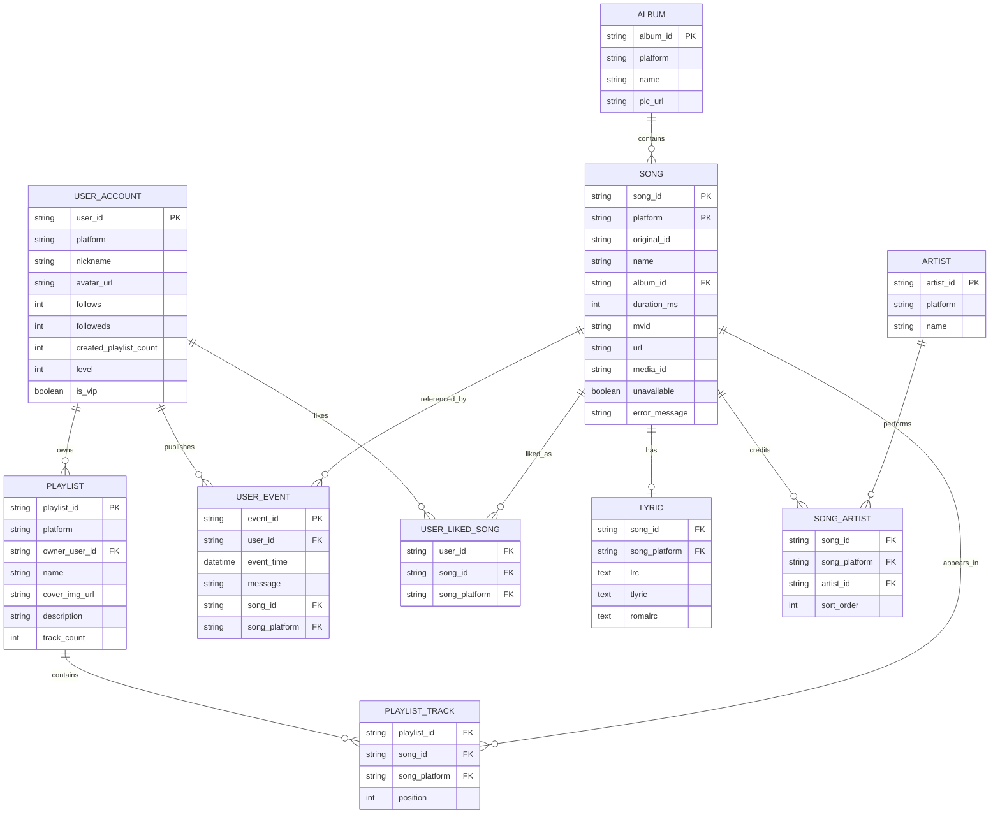
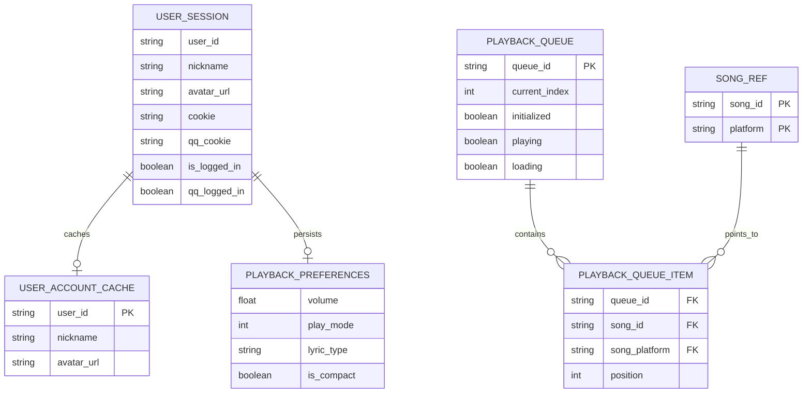

# 项目 ER 图

## 说明

LUO Music 当前没有自建关系型数据库，这里的 ER 图表达的是项目中的统一业务数据模型，以及前端本地持久化状态之间的关系。

这次优化后的版本做了两件事：

1. 把“音乐业务实体”和“本地运行时状态”拆成两张图，避免一张图过于拥挤
2. 把数组关系统一抽象成关联实体，明确哪些关系是逻辑上的 join table，哪些是本地持久化状态

## 图 1：核心音乐业务模型

### 图 1 中文解读

`PK` 表示主键，`FK` 表示外键。图中的英文关系名保留给 Mermaid 使用，下面给出对应中文含义。

| 关系                                 | 中文解释                                                           |
| ------------------------------------ | ------------------------------------------------------------------ |
| `USER_ACCOUNT owns PLAYLIST`         | 一个用户账号可以拥有多个歌单。                                     |
| `USER_ACCOUNT publishes USER_EVENT`  | 一个用户账号可以发布多条动态。                                     |
| `USER_ACCOUNT likes USER_LIKED_SONG` | 一个用户账号可以产生多条“我喜欢的歌曲”关联记录。                   |
| `ALBUM contains SONG`                | 一张专辑可以包含多首歌曲。                                         |
| `SONG has LYRIC`                     | 一首歌曲可以关联一份歌词数据，里面可同时包含原文、翻译和罗马音。   |
| `SONG credits SONG_ARTIST`           | 一首歌曲可以关联多位歌手署名。                                     |
| `ARTIST performs SONG_ARTIST`        | 一位歌手也可以参与多首歌曲，因此这里是歌曲和歌手的多对多关系。     |
| `PLAYLIST contains PLAYLIST_TRACK`   | 一个歌单包含多条歌单条目，`position` 表示歌曲在歌单中的顺序。      |
| `SONG appears_in PLAYLIST_TRACK`     | 同一首歌曲可以出现在多个歌单条目中，因此歌曲和歌单也是多对多关系。 |
| `SONG referenced_by USER_EVENT`      | 用户动态可以引用某一首歌曲。                                       |
| `SONG liked_as USER_LIKED_SONG`      | “我喜欢的歌曲”关系最终指向具体歌曲。                               |

| 实体              | 中文解释                                                     |
| ----------------- | ------------------------------------------------------------ |
| `USER_ACCOUNT`    | 用户账号聚合实体，表示页面展示和业务逻辑所需的用户资料。     |
| `PLAYLIST`        | 歌单实体，包含歌单名称、封面、描述和曲目数量。               |
| `PLAYLIST_TRACK`  | 歌单条目实体，用来表示“哪首歌在某个歌单里，以及排在第几位”。 |
| `SONG`            | 歌曲主实体，是播放器、歌单、动态等模块共享的统一歌曲模型。   |
| `ALBUM`           | 专辑实体，用来归属歌曲。                                     |
| `ARTIST`          | 歌手实体。                                                   |
| `SONG_ARTIST`     | 歌曲与歌手之间的关联实体，用来承载多歌手和排序信息。         |
| `LYRIC`           | 歌词实体，包含原文歌词、翻译歌词、罗马音歌词。               |
| `USER_EVENT`      | 用户动态实体，表示用户中心中的动态流内容。                   |
| `USER_LIKED_SONG` | 用户喜欢歌曲的关联实体，表示“用户喜欢了哪首歌”。             |

## 图 2：本地会话与播放状态模型

### 图 2 中文解读

这张图描述的不是远端业务数据，而是前端本地会话、播放器偏好和运行时队列状态。

| 关系                                          | 中文解释                                                             |
| --------------------------------------------- | -------------------------------------------------------------------- |
| `USER_SESSION caches USER_ACCOUNT_CACHE`      | 当前登录会话会缓存一份精简版用户信息，供页面快速恢复展示。           |
| `USER_SESSION persists PLAYBACK_PREFERENCES`  | 当前会话会持久化播放器偏好，例如音量、播放模式、歌词类型和紧凑模式。 |
| `PLAYBACK_QUEUE contains PLAYBACK_QUEUE_ITEM` | 一个播放队列由多条队列项组成，`current_index` 表示当前播放到哪一项。 |
| `SONG_REF points_to PLAYBACK_QUEUE_ITEM`      | 每条队列项都只保存歌曲引用，真正的歌曲详情仍由统一歌曲模型承载。     |

| 实体                   | 中文解释                                                    |
| ---------------------- | ----------------------------------------------------------- |
| `USER_SESSION`         | 本地用户会话实体，保存登录态、昵称、头像和平台 Cookie。     |
| `USER_ACCOUNT_CACHE`   | 精简用户信息缓存，只保留恢复 UI 所需的最小字段。            |
| `PLAYBACK_PREFERENCES` | 播放器偏好设置，属于会落盘的本地配置。                      |
| `PLAYBACK_QUEUE`       | 播放器运行时队列实体，描述当前队列整体状态。                |
| `PLAYBACK_QUEUE_ITEM`  | 队列中的单个条目，表示某首歌在当前队列中的位置。            |
| `SONG_REF`             | 歌曲引用实体，只保留 `song_id` 和 `platform` 两个标识字段。 |

## 实体落点

| 实体                                     | 主要来源                                                      | 说明                             |
| ---------------------------------------- | ------------------------------------------------------------- | -------------------------------- |
| `SONG` / `ALBUM` / `ARTIST`              | `src/types/schemas.ts`、`src/platform/music/interface.ts`     | 项目统一歌曲领域模型             |
| `PLAYLIST`                               | `src/types/schemas.ts`、`src/composables/useUserPlaylists.ts` | 用户歌单与歌单详情               |
| `USER_ACCOUNT`                           | `src/store/userStore.ts`、`src/composables/useUserData.ts`    | 用户基础资料与统计信息的聚合模型 |
| `USER_SESSION`                           | `src/store/userStore.ts`                                      | 本地持久化登录态与平台 Cookie    |
| `USER_EVENT`                             | `src/composables/useUserEvents.ts`                            | 用户动态流，部分动态会引用歌曲   |
| `USER_LIKED_SONG`                        | `src/composables/useLikedSongs.ts`                            | 用户喜欢歌曲集合                 |
| `PLAYBACK_QUEUE` / `PLAYBACK_QUEUE_ITEM` | `src/store/playerStore.ts`、`src/store/playlistStore.ts`      | 当前播放队列与顺序               |
| `PLAYBACK_PREFERENCES`                   | `src/store/playerStore.ts`                                    | 实际持久化的播放器偏好           |
| `LYRIC`                                  | `src/types/schemas.ts`、`src/store/player/playerState.ts`     | 原文、翻译、罗马音歌词           |

## 设计取舍

1. `SONG` 在项目里应视为 `(song_id, platform)` 复合主键，因为网易云和 QQ 是双数据源。
2. `PLAYLIST_TRACK` 对应 `PlaylistDetail.tracks`，`SONG_ARTIST` 对应 `Song.artists`，两者都是逻辑关联实体，不是现有独立存储表。
3. `USER_ACCOUNT` 是聚合实体，数据来自 `userStore`、`useUserData`、`useUserPlaylists`、`useLikedSongs` 等多个模块。
4. `USER_SESSION` 和 `PLAYBACK_PREFERENCES` 才是当前真正会落到本地存储的核心状态。
5. 图中保留 `PLAYBACK_QUEUE` 用于说明当前歌曲、队列顺序和歌曲实体之间的关系，不表示项目中有专用的播放队列数据表。

## 建议使用方式

1. 讨论歌曲、歌单、用户数据流时，看“图 1：核心音乐业务模型”
2. 讨论持久化、恢复播放偏好、登录态时，看“图 2：本地会话与播放状态模型”
